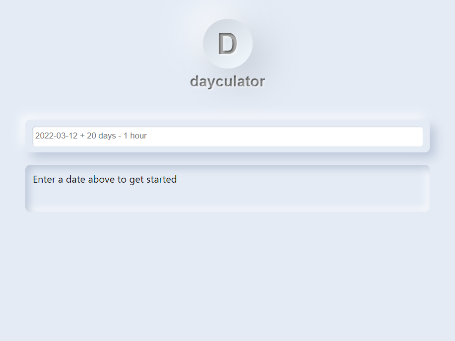

As part of my work at AstraZeneca I was working on a module that interprets schedule configuration which was heavily relying on date math. Forced to use various date calculators with slow user interfaces, I decided to create my own: [dayculator.com](https://www.dayculator.com/). 

<!-- end -->
Dayculator is a date calculator that doesn't force you to fill in an entire form to add an subtract a few days. It might not be the most intuitive tool out there, but the target audience is people who are keyboard savy, or people who just want to paste in a unix/ISO8601/RFC2822 timestamp and add/subtract a unit of time or two.

 

The web application is using NextJS, hosted on Vercel, build with Typescript and React.