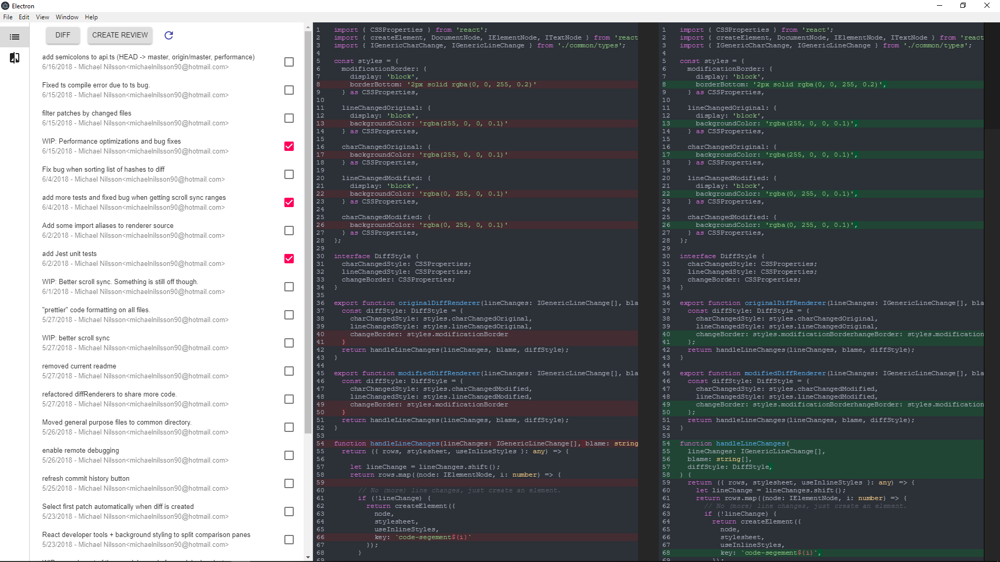
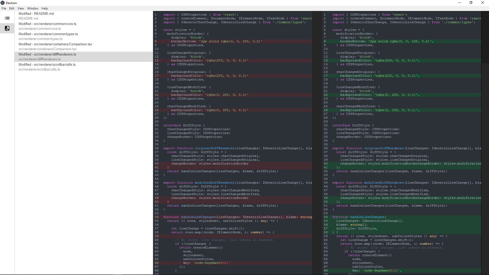

I attempted to create a modern diff and code review tool. The goal was to facilitate code review in trunk based development.
<!-- end -->

My perception is that most diff tools available today was developed in another era. Many of them, doesn't include some of the most basic features like: 

* Syntax highlighting.
* Word/character diff.
* Side-by-side diff.

I want a single application I can turn to when I am about to look at, and review other peoples code. Not necessarily all the features of a Git GUI client. I want to be able to search for the commits i want to review, then select them all at once, or one by one. Then I want to write comments, right there in the code. 

One feature that I haven't seen anywhere else, is being able to review multiple non-sequential commits on a single branch, without including all commits in-between. A use case specifically for trunk based development, where you typically won't review the diff of an entire branch (e.g. Pull request).

lets say I want to review commit A and C: 

`HEAD -> A -> B -> C...`

In most diff/review tools, when I select these commits in the GUI, it would show me all changes that have been made in commit A, B and C. What I actually want is for the viewer to filter out or atleast distinguish between the changes made in commits I selected, and the commits that are made in-between (in this case C). This could of course lead to conflicts where the commits in-between have modified the same lines of code, but I really don't think this is a problem in 99% of the time.

In diffuse, I tried to solve this by looking at the git blame. First we take the entire diff from commit A to C, then look at each individual hunk to see if it was commited in the selected commits. If it was not, the hunk is not highlighted. If nothing is highlighted in an entire file, the file is removed from the diff. This way, only the diff of interest will be presented.

Apart from the performance issue of performing the git blame, it works quite well! Diffuse includes the basic features mentioned in the beginning, but i've also worked hard to get a nice syncronized scroll similar to how it looks in P4Merge (not leaving any blank spaces in the code when lines are added or removed). 

I couldn't find any diff libraries on NPM that were detailed enough to support the features I wanted. Instead, I dug into [the source of Visual Studio Code](https://github.com/Microsoft/vscode) and extracted (stole with pride) their diff related source code. From it, I created a new npm package called [vscode-diff](https://www.npmjs.com/package/vscode-diff) that i intend to keep up to date with the original source.

|  |  |
|---|---|
|  |  |

Unfortunately this is very far from finished, and I have no plans to continue developing right now.

Tech used:
This is an **Electron** application written in **Typescript**, **React** and **Redux**. 