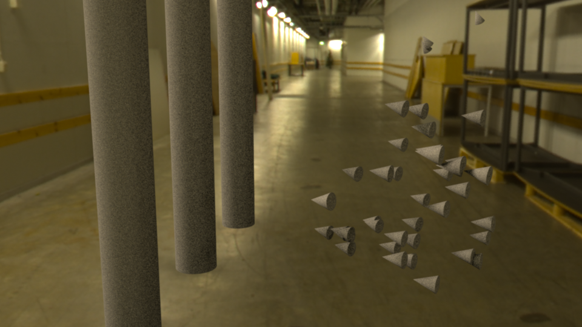

A Python script for Autodesk Maya that allows for creating flocking animations of boids.
<!-- end -->
This script creates bird-like behaviour of a objects in Maya based on the original [algorithm](http://www.red3d.com/cwr/boids/) by Craig Reynolds. The script is used by defining a flying-boundary, cylinder obstacles, a path to follow (optional) and the number of boids. The script will then create a natural and believable simulation of bird flocking behaviour.

Project was made by me and a class mate can be found on [Github](https://github.com/micnil/maya-flocking-boids).