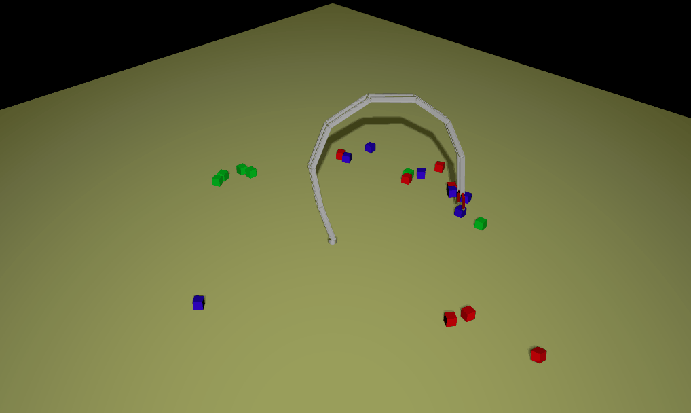

For a course called 2D & 3D Animation at Nanyang Technological University in Singapore, I developed a robot arm simulation that tries to sort boxes based on color while the user disrupts with the mouse pointer.
<!-- end -->
The robot arm movement is simulated using inverse kinematics. Each delta movement is found with an pseudo inverse jacobian algorithm with damping. The arm has been made stiff and the target position for each segment is manipulated to avoid "uncomfortable" positions. The algorithm was first tested in a pure **javascript** 2D version which can be found [here](http://micnil.github.io/inverse_kinematics_2D), and was later ported to this improved 3D version using **webGL** through the Three.js framework. Apart from that, Cannon.js is used for the box physics and Sylvester.js is used for matrix operations.

 

Project can be found on [Github](https://github.com/micnil/inverse_kinematics_3D) and this [demopage](http://micnil.github.io/inverse_kinematics_3D)