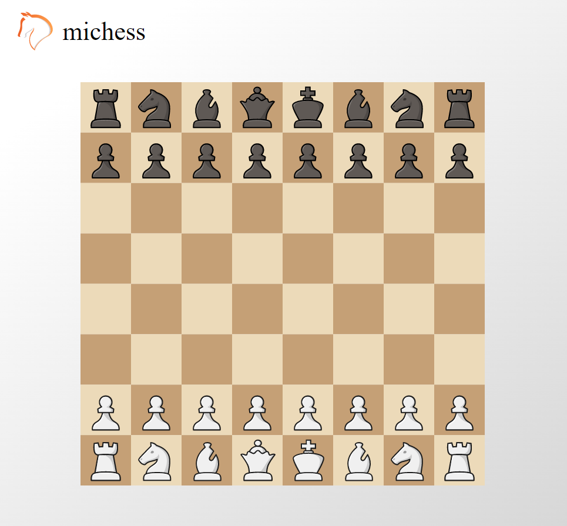

In 2019 I rediscovered my childhood hobby: Chess. As an avid player on [Lichess.org](www.lichess.org) and a programmer by profession, I couldn't help myself to try creating my own chess engine [michess](https://github.com/micnil/michess). 

<!-- end -->

The goal is to create a chess AI good enough to beat myself. In the process, I'm developing a web application where you can play against it or just play with the board editor to analyze your games.  

 

The project is build in a modular way, where the intention is to publish the React board editor, chess rules and the AI as three seperate npm packages. The technologies used are Typescript and React.