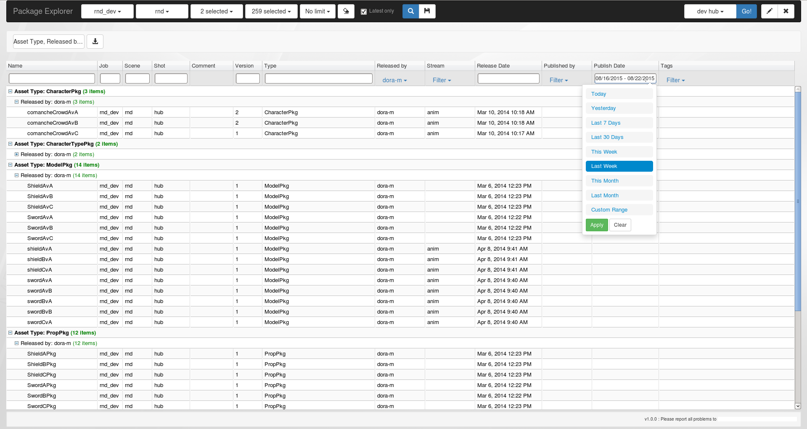

I did an 8 week internship at one of the global leaders in VFX, where I was part of the Production Tools team and developed a web application that can browse and filter the assets that artists create. 

<!-- end -->
The team I was part of develops and maintains web based applications with the purpose to deal with production planning and management. This includes applications that handles scheduling, feedback/reviews, viewing of assets and shot samples (“*dailies*”), planning rendering times and priority, managing staff timesheets, administering user permissions to the intranet and more. During my time at MPC I was introduced to most aspects of the visual effects pipeline, and the technology behind it. However, my main project was to rebuild a web application called the Package Explorer from scratch, which had been non-functional for around a year due to changes in the architecture. The rebuild would allow stakeholder to give input for new requirements aswell.

Anything that an artist at MPC produces from their work is saved and versioned. With every versioned file there is information in the form of timestamps, tags, metadata, comments, descriptions, names, users, availability in sites and of dependencies, these files are referred to as assets. Considering that MPC works on several movies at any given time, and that each movie has several hundred shots, there will be more assets than it is possible to keep track of without helpful tools. Package Explorer was one of these tools and was made for browsing and filtering of assets.

|  |  |
|---|---|
|  |  |

The application was written in **vanilla JS** (without any front-end JS frameworks), designed in a classic **MVC** pattern and leveraging various third-party components like the grid, date picker and filter dropdowns. **Bootstrap** was chosen as the as the CSS framework.