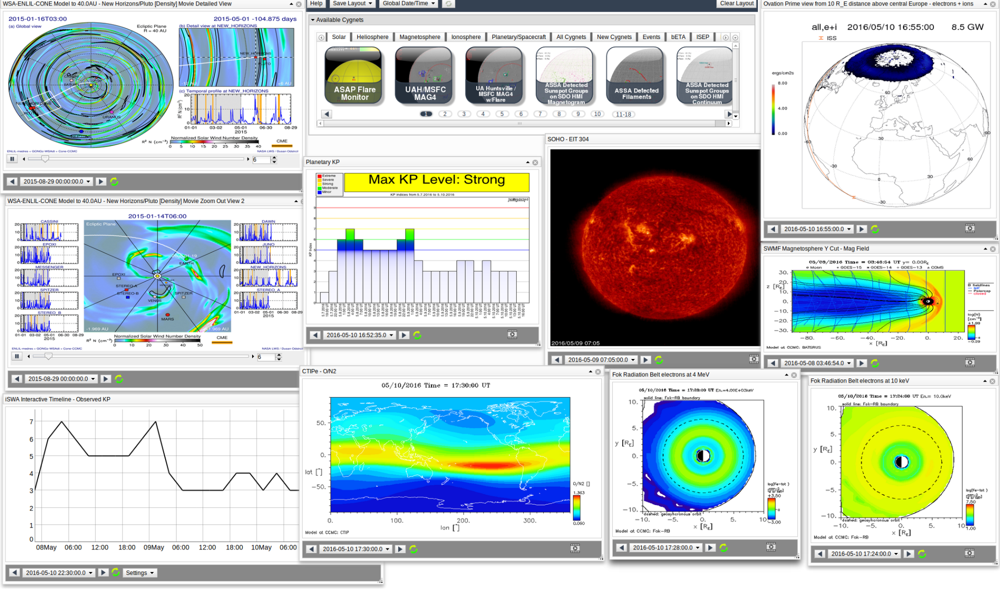
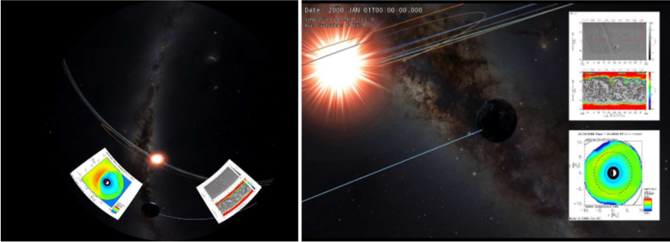
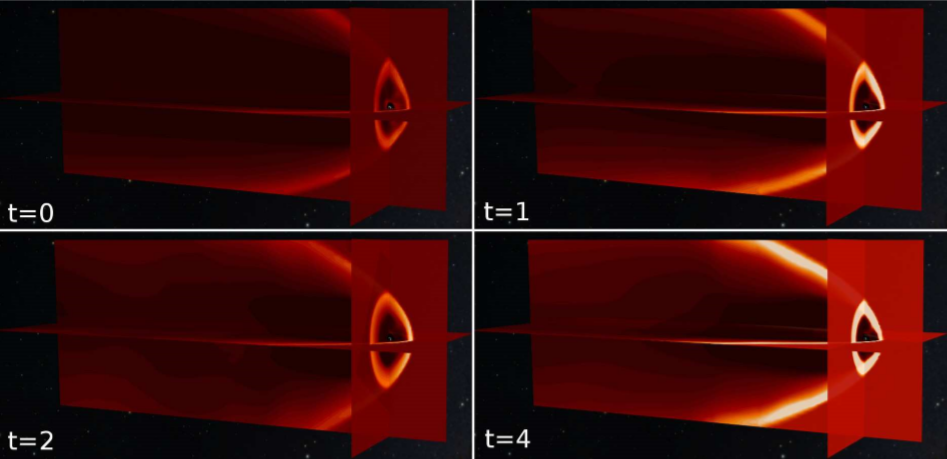
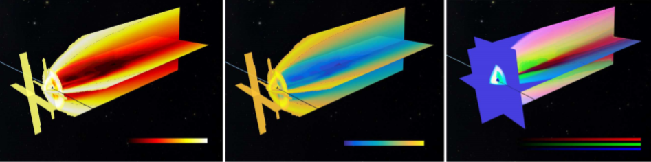
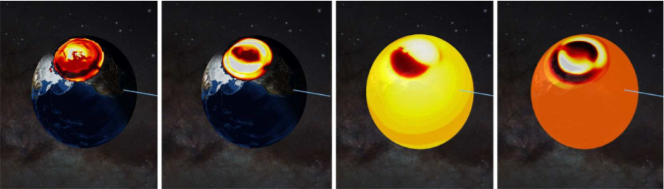
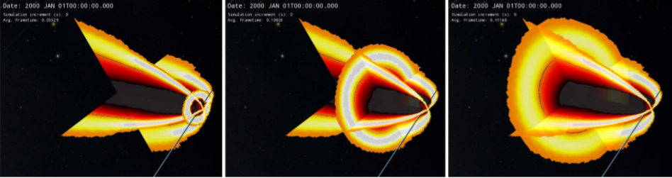

I spent five months at NASA in Washington DC working on a project called [OpenSpace](https://www.openspaceproject.com/) which is a collaboration between Linköping University, NASA's Goddard Space Flight Center and American Museum of Natural History. This project aims to visualize the what we know about the universe using real data provided by NASA.
<!-- end -->

Abstract from [report](http://www.diva-portal.org/smash/record.jsf?pid=diva2%3A1072646&dswid=-7149)
> This thesis aims to provide public science dissemination of space weather data by integrating a space weather analysis system used by experts in the field into an interactive visualization software called OpenSpace; designed to visualize the entire known Universe. Data and images from complex space weather models were processed and used as textures on different surface geometries, which are then positioned, oriented and scaled correctly relative other planets in the solar system. The obtained results were within the goals of the thesis and has successfully incorporated several features that will help understanding of space weather phenomena.

The Community Coordinated Modeling Center (CCMC) is an agency at NASA that provides access to modern space weather research models to the scientific community. They use a system called [iSWA (Integrated Space Weather Analysis System)](https://iswa.gsfc.nasa.gov/IswaSystemWebApp/) to analyze and forecast space weather, and particularly events like [solar flares](https://en.wikipedia.org/wiki/Solar_flare) and [coronal mass ejections (CME)](https://en.wikipedia.org/wiki/Coronal_mass_ejection). iSWA is a web application with a dashboard where you can select and **image stream (Cygnet)** of near real time information, generated from physical models and measurements. The models collect information from a multitude of sources and is a vital tool for the space weather community.

*The iSWA dashboard presenting a couple of the over 400 cygnets*

Our goal was to make this data more available and intuitive for non-scientists, this is where OpenSpace comes in. OpenSpace is open source interactive data visualization software designed to visualize the entire known universe and portray our ongoing efforts to investigate the cosmos. OpenSpace works on high resolution tiled displays and planetarium domes, which is great for public presentations where the audience is guided through the universe. The plan was to stream the 2-dimensional data from iSWA, and position it correctly in the 3 dimensional OpenSpace.

Unfortunately, the output of the iSWA service was not well formed for our use-case. We instead decided to prototype what would be possible if the data was standardized, and a lower-level API was made available. We took on this task in three steps.

#### 1. Streaming cygnets directly from iSWA
We made use of the existing service to stream cygnets and placing them as billboards in screen space. This allowed the user to find a list of over 400 cygnets directly in the OpenSpace GUI, and check them display them on the screen. There was also a clunky way of moving them around. The main challenge here was get the projection right for multi-projector dome displays. Moving the cygnet around must work both in spherical and euclidean coordinates. 

*Screen space cygnets streamed from iSWA in OpenSpace-time*

#### 2. Visualization cygnets
Visualization cygnets are what we called the images that we generated from the raw data that are behind the cygnets on iSWA. This data was hosted on our own [demo server](https://github.com/OpenSpace/iswa-demo-server), and streamed and transformed to textures that were put on spheres and planes. The spheres and planes were positioned from metadata about each cygnet, that was provided from the models that generated the data. I'll skip the method and challenges encountered with data normalization, contrast, filtering, reference frames, and get right to some results.

*Three perpendicular cut planes visualizing pressure in the magnetosphere, presented as a timeseries with approximately 10 hours between each time step.*

*Different color maps can be used for the same data. The first and second image portrays the same data variable with color maps of different nuances. The third image, three different data variables are rendered on the same planes but with different color maps: red, green and blue. All are contrast enhanced and auto-filtered.*

*Visualization of the Ionosphere, presented with four different data variables: Eave (average energy), eflux (energy flux), ep (electric potential) and jr (radial current component) respectively from left to right.*

#### 3. CDF cygnets
CDF is a data format for the storage of large scalar and multidimensional data in a platform- and discipline-independent way. These data files did not really have anything to do with iSWA, and they were too large to stream on demand. Reading them from disk however, allowed us to add more interactivity to the visualization, with the downside of only being able to load one time-step at a time. Since these Cygnets represents a cut plane of a 3D region the planes can be dragged through the volumetric data generating new images each frame, which made a nice x-ray visualization of the magnetosphere.

*Three cut-planes interpolated from a CDF-file, one of which is dragged through the volume.*

#### Tech stack
**C++** and **OpenGL**. **NodeJS** for the demo server.